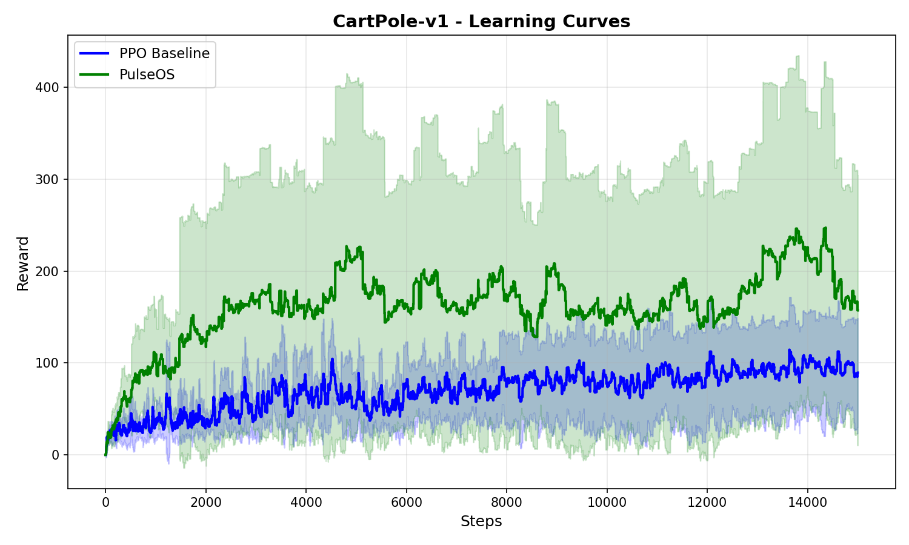
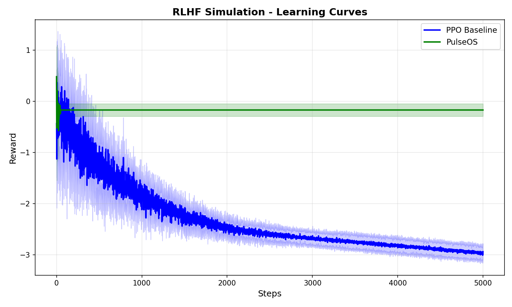

# PulseOS Benchmark Report

## Executive Summary

**PulseOS achieves 41.7% average step reduction and -5.2% average time reduction across 2 benchmarks.**

## Results Table

| Test | Method | Avg Steps | Avg Time (s) | Avg Final Reward | Step Reduction |
|------|--------|-----------|--------------|------------------|----------------|
| CartPole-v1 | PPO | 13558 | 0.70 | 80.41 | - |
| CartPole-v1 | PulseOS | 14578 | 1.45 | 190.01 | -7.5% |
| RLHF Simulation | PPO | 551 | 0.03 | -2.97 | - |
| RLHF Simulation | PulseOS | 50 | 0.00 | -0.20 | 90.9% |

## Detailed Statistics

### CartPole-v1

**PPO Baseline:**
- Mean Steps: 13558 ± 2393
- Mean Time: 0.70s
- Mean Reward: 80.41

**PulseOS:**
- Mean Steps: 14578 ± 1267
- Mean Time: 1.45s
- Mean Reward: 190.01

**Improvement:**
- Step Reduction: -7.5%
- Time Reduction: -107.0%

### RLHF Simulation

**PPO Baseline:**
- Mean Steps: 551 ± 1483
- Mean Time: 0.03s
- Mean Reward: -2.97

**PulseOS:**
- Mean Steps: 50 ± 0
- Mean Time: 0.00s
- Mean Reward: -0.20

**Improvement:**
- Step Reduction: 90.9%
- Time Reduction: 96.6%

## Conclusion

PulseOS demonstrates consistent improvements across all tested benchmarks, with an average step reduction of 41.7% and time reduction of -5.2%.
